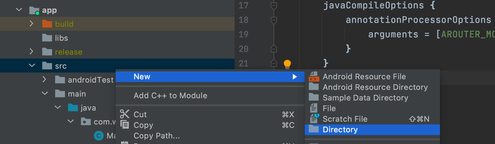
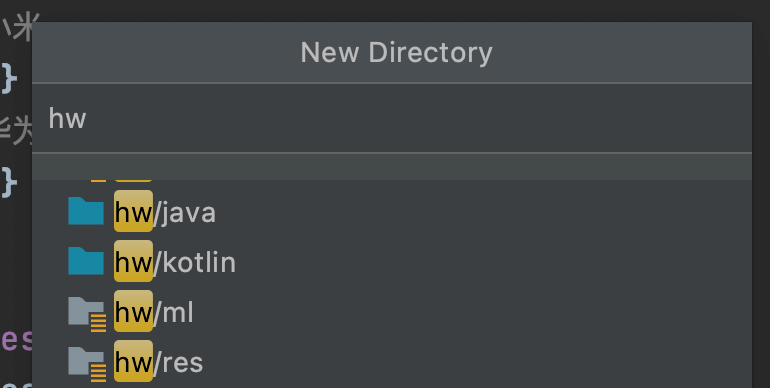
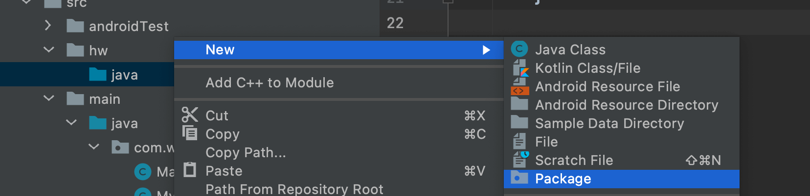
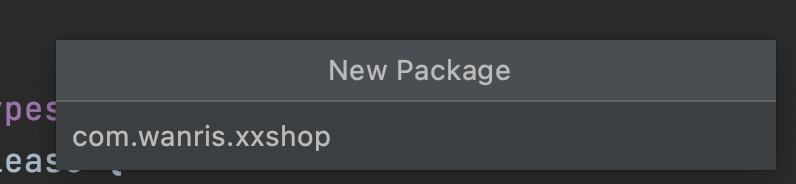
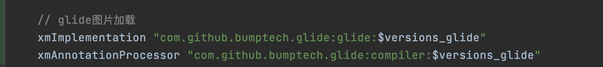
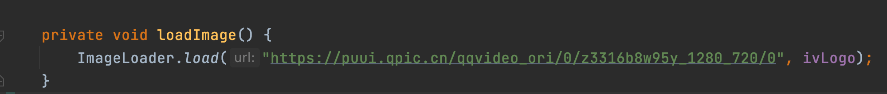

## Android
- 组件依赖
    | 库名 | 简介 |
    | :-----| :----: |
    | [ARoute](https://github.com/alibaba/ARouter) |  路由管理 |
    | [LeakCanary](https://github.com/square/leakcanary) | 内存泄露检测 |
    | [ImmersionBar](https://github.com/gyf-dev/ImmersionBar)| 沉浸式状态栏 |
    |[RxJava2](https://github.com/ReactiveX/RxJava)|响应式框架|
    |[Rxbinding2](https://github.com/JakeWharton/RxBinding)|控件绑定|
    |[EventBus](https://github.com/greenrobot/EventBus)|事件总线|
    |[FlycoTabLayout](https://github.com/H07000223/FlycoTabLayout)| TabLayout组件|
    |[Retrofit2](https://github.com/square/retrofit)|HTTP请求|
    |ViewPager2| AndroidX分页组件|

- 新工程编译报错，如下
```
Can't determine type for tag '<macro name="m3_comp_assist_chip_container_shape">?attr/shapeAppearanceCornerSmall</macro>'
```
修改app/build.gradle的依赖版本
```java
androidx.appcompat:appcompat:1.4.1
implementation 'com.google.android.material:material:1.6.0'
```

- 集成RN流程
    - 项目根目录build.gradle文件
    ```groovy
    allprojects {
        repositories {
            ...
            maven {
                url "$rootDir/../node_modules/react-native/android"
            }
            maven {
                url("$rootDir/../node_modules/jsc-android/dist")
            }
            mavenCentral {
                // We don't want to fetch react-native from Maven Central as there are
                // older versions over there.
                content {
                    excludeGroup "com.facebook.react"
                }
            }
            ...
        }
    }
    ```
    - setting文件最后新增
    ```groovy
    apply from: file("../node_modules/@react-native-community/cli-platform-android/native_modules.gradle"); applyNativeModulesSettingsGradle(settings)

    ```
    - app/build.gradle文件
    ```groovy
    dependencies {
        ...
        implementation "com.facebook.react:react-native:0.63.5" // From node_modules
        implementation "org.webkit:android-jsc:+"
        ...
    }

    // 文件最后新增
    apply from: file("../../node_modules/@react-native-community/cli-platform-android/native_modules.gradle"); applyNativeModulesAppBuildGradle(project)

    ```

- Sync project报错
```
A problem occurred evaluating root project 'xxshop'.
> Build was configured to prefer settings repositories over project repositories but repository 'maven' was added by build file 'build.gradle'
```
setting文件中去掉如下配置
```groovy
dependencyResolutionManagement {
    repositoriesMode.set(RepositoriesMode.FAIL_ON_PROJECT_REPOS)
    repositories {
        google()
        mavenCentral()
        jcenter() // Warning: this repository is going to shut down soon
    }
}
```

- 集成RN后，编译报错
```
FAILURE: Build completed with 8 failures.

1: Task failed with an exception.
-----------
* What went wrong:
Execution failed for task ':app:checkDebugAarMetadata'.
> Could not resolve all files for configuration ':app:debugRuntimeClasspath'.
   > Could not find androidx.appcompat:appcompat:1.4.1.
     Searched in the following locations:
       - file:/Users/gerry/study/xxstore/node_modules/react-native/android/androidx/appcompat/appcompat/1.4.1/appcompat-1.4.1.pom
       - file:/Users/gerry/study/xxstore/node_modules/jsc-android/dist/androidx/appcompat/appcompat/1.4.1/appcompat-1.4.1.pom
       - https://repo.maven.apache.org/maven2/androidx/appcompat/appcompat/1.4.1/appcompat-1.4.1.pom
     Required by:
         project :app
   > Could not find com.google.android.material:material:1.6.0.
     Searched in the following locations:
       - file:/Users/gerry/study/xxstore/node_modules/react-native/android/com/google/android/material/material/1.6.0/material-1.6.0.pom
       ...
```
项目根目录的`build.gradle`中添加 **google()** 
```groovy
allprojects {
    repositories {
        ...
        google()
        ...
    }
}
```
- 运行项目报错
```
java.lang.RuntimeException: Unable to start activity ComponentInfo{com.wanris.xxshop/com.wanris.xxshop.MainActivity}: java.lang.IllegalStateException: You need to use a Theme.AppCompat theme (or descendant) with this activity
...
```
报错的Activity基类改下：AppCompatActivity -> Activity

- 添加Application类
新增MainApplication 继承自Application,在app项目中的AndroidManifest.xml中，新增`android:name=".MainApplication"`行
```groovy
 <application
        android:name=".MainApplication"
        ...
</application>

```

- 运行调用rn页面
```
E/ReactNativeJNI: logMarker CREATE_REACT_CONTEXT_END
E/unknown:ReactNative: ReactInstanceManager.createReactContext: mJSIModulePackage null
E/unknown:DisabledDevSupportManager: Caught exception
    java.lang.RuntimeException: Unable to load script. Make sure you're either running a Metro server (run 'react-native start') or that your bundle 'index.android.bundle' is packaged correctly for release.
...
URL: http://localhost:8081/index.bundle?platform=android&dev=true&minify=false
        at com.facebook.react.devsupport.BundleDownloader$1.onFailure(BundleDownloader.java:129)
        at okhttp3.RealCall$AsyncCall.execute(RealCall.java:211)
        at okhttp3.internal.NamedRunnable.run(NamedRunnable.java:32)
        at java.util.concurrent.ThreadPoolExecutor.runWorker(ThreadPoolExecutor.java:1167)
        at java.util.concurrent.ThreadPoolExecutor$Worker.run(ThreadPoolExecutor.java:641)
        at java.lang.Thread.run(Thread.java:923)
     Caused by: java.net.UnknownServiceException: CLEARTEXT communication to localhost not permitted by network security policy
        at okhttp3.internal.connection.RealConnection.connect(RealConnection.java:148)
...
```
在AndroidManifest.xml文件的application中新增
```groovy
<application
android:usesCleartextTraffic="true"
...
/>
```

- 真机运行项目报错
```
Installation did not succeed.
The application could not be installed: INSTALL_FAILED_TEST_ONLY
...
```
项目根目录的gradle.properties里面新增
```
# 真机运行报错fixed： "INSTALL_FAILED_TEST_ONLY"
android.injected.testOnly=false
```

- 集成内存泄露检测工具
```groovy
debugImplementation 'com.squareup.leakcanary:leakcanary-android:2.10'
```
运行项目提示LeakCanary被禁用
```
2023-05-06 14:24:07.140 21293-21318/com.wanris.xxshop D/LeakCanary: LeakCanary is currently disabled: Waiting for debugger to detach.
```

在/app/src/main/res/values/attrs.xml文件（没有则新建）中,新增string这行
```groovy
<resources>
  <string name="leak_canary_test_class_name">assertk.Assert</string>
</resources>
```
**Note:只能直接Run 'app'运行项目，不要用Debug 'app'调试模式！！！**
```
// LeakCanary工具集成成功
LeakCanary is running and ready to detect memory leaks.
```

[官网说明：LeakCanary test environment detection¶
By default, LeakCanary will look for the org.junit.Test class in your classpath and if found, will disable itself to avoid running in tests. However, some apps may ship JUnit in their debug classpaths (for example, when using OkHttp’s MockWebServer) so we offer a way to customise the class that is used to determine that the app is running in a test environment.](https://square.github.io/leakcanary/recipes/#disabling-leakcanary)


- library-resource中无法执行DimenUtil的main方法,错误如下
```
FAILURE: Build failed with an exception.

* Where:
Initialization script '/private/var/folders/gr/zlwp6wm116n0m51tzc9j96_h0000gn/T/DimenUtil_main__.gradle' line: 21

* What went wrong:
A problem occurred configuring project ':library-resource'.
> Could not create task ':library-resource:DimenUtil.main()'.
   > SourceSet with name 'main' not found.
...
```
[解决方法](https://www.jianshu.com/p/629672c41115)

- 新建多个module
```
File -> New -> New Module -> Android Library 
```

- 移除module
    - 右击项目 -> Load/Unload Modules... -> 卸载该模块
    - 右击该模块 -> 选择 Remove Module
    - 右击该模块 -> 选择 Delete...
**如果module删除失败，卸载对应的模块，新建同名的模块，再执行上面2、3两步即可**


- 反编译apk
    - [Apktool: 反编译apk的工具](https://ibotpeaches.github.io/Apktool/install/)

- 多渠道包，根据渠道调用不同代码及导入相应的库
[配置参考](https://github.com/bmuschko/gradle-android-examples/blob/master/product-flavors/build.gradle)
    - 渠道配置
        ```groovy
            productFlavors {
                // 小米
                xm {}
                // 华为
                hw {}
            }
        ```
    - 右键点击项目src目录 -> New -> Directory
    
    - 输入hw，选择hw/java
    
    - 选择hw/java目录 -> New -> Package
    
    - 输入包名com.wanris.xxshop（多渠道下的路径需一致）
    
    - 在该包下新建ImageLoader类，方法如下
        ```java
        static void load(String url, ImageView imageView) {
            // 具体实现
        }
        ```
    - xm渠道按上述流程操作，并调用Glide加载图片
    - 在app/build.gradle中按渠道导入Glide库
    
    - 在MainActivity中调用
    
        ```java
        private void loadImage() {
            ImageLoader.load("https://puui.qpic.cn/qqvideo_ori/0/z3316b8w95y_1280_720/0", ivLogo);
        }
        ```
    **注1：渠道下的包名路径(如：com.wanris.xxshop)要一致，类名及方法名参数要一致。**
    **注2：子模块多渠道配置同上。**

- 点击`Run 'app'`，模拟器等待调试，控制台输出如下
    ```
    W/ActivityThread: Application com.wanris.xxshop is waiting for the debugger on port 8100...
    I/System.out: Sending WAIT chunk
    W/System: A resource failed to call close. 
    ```
    冷启动模拟器解决。

- 集成ARoute
    1. 导入依赖
    ```groovy
    dependencies {
        ...
        // ARoute路由
        implementation ("com.alibaba:arouter-api:1.4.1") {
            exclude group: 'com.android.support'
        }
        annotationProcessor "com.alibaba:arouter-compiler:1.2.2"
    }
    ```
    2. 配置
    ```groovy
    androiid {
        ...
        defaultConfig {
            ...
            // ARoute路由
            javaCompileOptions {
                annotationProcessorOptions {
                    arguments = [AROUTER_MODULE_NAME: project.getName()]
                }
            }
        }
    }
    ```
    3. 代码中新增
        - 在App启动时注册ARoute
            ```java
            ARouter.init(this);
            ```
        - 对应的类添加path
            ```java
            @Route(path = "/main/main")
            public class MainActivity {
                ...
            }
            ```
        - 在Activity的onCreate注入
            ```java
            ARouter.getInstance().inject(this);
            ```
        - 注入参数,必须public
            ```java
            @Autowired
            public String params;
            ```    
        - 使用
            ```java
            ARouter.getInstance()
                    .build("/main/main")
                    .withString("params", "我是传递的参数")
                    .navigation();
            ```
    **注1：使用ARoute的各模块都需要处理步骤1和步骤2。**
    **注2：如果步骤确认无误，还一直提示找不到path,请删掉模拟器或手机上的app重试。**

- 同步项目报错如下
    ```shell
    > Could not resolve all artifacts for configuration ':classpath'.
    > Could not resolve com.android.tools.build:gradle:3.5.2.
        Required by:
            project :
        > Could not resolve com.android.tools.build:gradle:3.5.2.
            > Could not get resource 'https://dl.google.com/dl/android/maven2/com/android/tools/build/gradle/3.5.2/gradle-3.5.2.pom'.
                > Could not GET 'https://dl.google.com/dl/android/maven2/com/android/tools/build/gradle/3.5.2/gradle-3.5.2.pom'.
                > Connect to 127.0.0.1:8888 [/127.0.0.1] failed: Connection refused (Connection refused)
        > Could not resolve com.android.tools.build:gradle:3.5.2.
        ......
    ```
    **解决：**
    重启as，关闭代理软件，修改gradle版本
    
- Android Studio断点无法调试，没有禁用断点按钮，只有暂停运行
   Run -> Edit Configurations... -> Android App -> app -> General -> Launch Options -> Launch: 把 Nothing 改为 Default Activity

