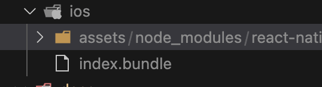
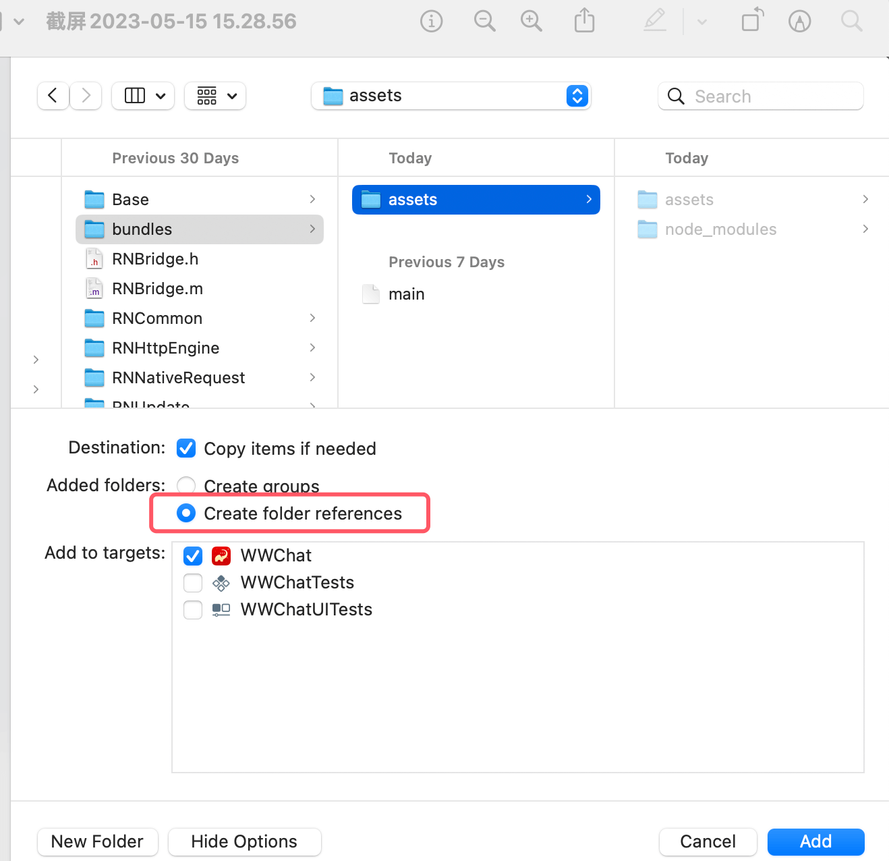
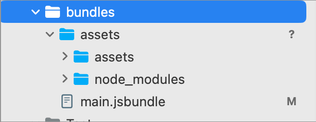

## iOS
- 集成React native
在工程的Podfile中新增
```ruby
    # 集成React native配置
    require_relative '../node_modules/react-native/scripts/react_native_pods'
    require_relative '../node_modules/@react-native-community/cli-platform-ios/native_modules'
    ...
    target 'xxshop' do
        # 集成React native配置
        config = use_native_modules!
        use_react_native!(:path => config["reactNativePath"])
        ...
        pod xxxx
        ...
    end
```
- 新建项目pod install报错
```
Analyzing dependencies
/Library/Ruby/Gems/2.6.0/gems/cocoapods-1.11.3/lib/cocoapods/user_interface/error_report.rb:34:in `force_encoding': can't modify frozen String (FrozenError)
	from /Library/Ruby/Gems/2.6.0/gems/cocoapods-1.11.3/lib/cocoapods/user_interface/error_report.rb:34:in `report'
	from /Library/Ruby/Gems/2.6.0/gems/cocoapods-1.11.3/lib/cocoapods/command.rb:66:in `report_error'
```
点击项目 -> General -> 右侧Project Document -> Project Format改为`Xcode 11.0-compatible`再执行

- 当前的rn版本不支持UISceme，如果项目有的话需要去掉UIScene相关代码
[解决方案](https://my.oschina.net/petsatan/blog/5261899)

- 字符串/字典转浮点值精度问题
    - 问题场景
        后台使用BigDecimal类型返回价格字段，客户端通过NSString类型接收兵显示则会发生精度丢失问题，接口返回的NSDictionary为NSNumber类型（float）。
        - 方案1. 使用CGFloat接收该数据
        - 方案2. 使用NSNumber格式化该值，再取stringValue
    - OC字符串转浮点值
        ```objc
        // 问题用法
        NSString *xx = @"69.9";
        NSString *yy = @"584.06";
        NSString *zz = @"71.2";

        float x = xx.floatValue;;
        float y = yy.floatValue;
        float z = zz.floatValue;

        NSLog(@"%f %f %f", x, y, z);
        // 输出: 69.900002 584.059998 71.199997
        ```
        使用时需要用NSNumber格式化下，再取stringValue
        ```objc
        NSNumber *nx = [NSNumber numberWithFloat:x];
        NSNumber *ny = [NSNumber numberWithFloat:y];
        NSNumber *nz = [NSNumber numberWithFloat:z];
        
        NSLog(@"%@, %@, %@", nx.stringValue, ny.stringValue, nz.stringValue);
        // 输出: 69.9, 584.06, 71.2
        ```
    - Swift CGFloat转String
        ```swift
        let price = "\(69.9)"
        // 不能用NSNumber转，会有精度问题
        ```
    
    - 字典中取浮点值
        ```objc
        // 问题用法
        NSDictionary *dict = @{@"v": @(69.9)};        
        NSNumber *n = dict[@"v"];    
        NSLog(@"%@", n.stringValue);
        // 输出: 69.90000000000001
        ```
        浮点值放入字典需要使用NSNumber转化下
        ```objc
        NSNumber *n1 = [NSNumber numberWithFloat:69.9];
        ```
    **建议：**
    **1. 浮点值转NSString时，需要使用NSNumber转化下再取stringValue;**
    **2. 不要使用`@(69.9)`格式化字典中的浮点;**

- XCode加载RN静态资源，rn项目中目录/assets下的图片等静态资源
    - 拷贝rn项目打包/ios目录中的assets文件夹到/RNComponents/bundles文件夹下，必须同index.bundle一样的目录；
    
    - 在XCode中添加该文件夹,选择`Create folder references`,不然图片打包ipa后会放在根目录，无法读取；
    
    - 文件夹添加后是蓝色的，如下图所示
    

    
- AFNetworking含UIWebView，审核被拒。
删掉AFNetworking中的`UIWebView+AFNetworking.h`和.m文件，删掉相关import "UIWebView+AFNetworking.h"的地方
- 在WebViewJavascriptBridge含UIWebView的处理。
手动删除文件`WebViewJavascriptBridge.h`和`WebViewJavascriptBridge.m`，在`WebViewJavascriptBridge-umbrella`文件中删掉`import "WebViewJavascriptBridge.h"`

或者在Podfile中新增
```ruby
post_install do |installer|
    dir_web = File.join(installer.sandbox.pod_dir('WebViewJavascriptBridge'), 'WebViewJavascriptBridge')
    Dir.foreach(dir_web) {|x|
      real_path = File.join(dir_web, x)
      if (!File.directory?(real_path) && File.exists?(real_path))
        if(x == 'WebViewJavascriptBridge.h' || x == 'WebViewJavascriptBridge.m')
          File.delete(real_path)
        end
      end
    }
    
    dir_web = File.join(installer.sandbox.pod_dir('AFNetworking'), 'UIKit+AFNetworking')
    Dir.foreach(dir_web) {|x|
      real_path = File.join(dir_web, x)
      if (!File.directory?(real_path) && File.exists?(real_path))
        if(x == 'UIWebView+AFNetworking.h' || x == 'UIWebView+AFNetworking.m' || x == 'UIKit+AFNetworking.h')
          File.delete(real_path)
        end
      end
    }
    
end
```

- `react-native-viewpager`链接失败，在`Pods` -> `react-native-viewpager` -> `Build Phases` -> `Link Binary With Libraries` 新增`React-Core`库再编译。

- XCode14.2中**SVGAPlayer**库编译报错。
错误提示如下
```
~/ios/Pods/SVGAPlayer/Source/pbobjc/Svga.pbobjc.m:605:14: error: implicit declaration of function 'OSAtomicCompareAndSwapPtrBarrier' is invalid in C99 [-Werror,-Wimplicit-function-declaration]
        if (!OSAtomicCompareAndSwapPtrBarrier(nil, worker, (void * volatile *)&descriptor)) {
             ^
~/ios/Pods/SVGAPlayer/Source/pbobjc/Svga.pbobjc.m:605:14: error: declaration of 'OSAtomicCompareAndSwapPtrBarrier' must be imported from module 'Darwin.libkern.OSAtomic' before it is required
...
```

在Svga.pbobjc.h文件中新增如下：
```objc
#include <libkern/OSAtomic.h>
```
[解决方案参考](https://stackoverflow.com/questions/76230814/xcode-firebase-message-error-osatomiccompareandswapptrbarrier)


- Pod glog库时报如下错或者https://www.github.com连接错误

<details>
<summary> xcrun: error: SDK "iphoneos" cannot be located </summary>

```
Installing glog (0.3.5)
[!] /bin/bash -c 
set -e
#!/bin/bash
# Copyright (c) Facebook, Inc. and its affiliates.
#
# This source code is licensed under the MIT license found in the
# LICENSE file in the root directory of this source tree.

set -e

PLATFORM_NAME="${PLATFORM_NAME:-iphoneos}"
CURRENT_ARCH="${CURRENT_ARCH}"

if [ -z "$CURRENT_ARCH" ] || [ "$CURRENT_ARCH" == "undefined_arch" ]; then
    # Xcode 10 beta sets CURRENT_ARCH to "undefined_arch", this leads to incorrect linker arg.
    # it's better to rely on platform name as fallback because architecture differs between simulator and device

    if [[ "$PLATFORM_NAME" == *"simulator"* ]]; then
        CURRENT_ARCH="x86_64"
    else
        CURRENT_ARCH="armv7"
    fi
fi

export CC="$(xcrun -find -sdk $PLATFORM_NAME cc) -arch $CURRENT_ARCH -isysroot $(xcrun -sdk $PLATFORM_NAME --show-sdk-path)"
export CXX="$CC"

# Remove automake symlink if it exists
if [ -h "test-driver" ]; then
    rm test-driver
fi

./configure --host arm-apple-darwin

# Fix build for tvOS
cat << EOF >> src/config.h

/* Add in so we have Apple Target Conditionals */
#ifdef __APPLE__
#include <TargetConditionals.h>
#include <Availability.h>
#endif

/* Special configuration for AppleTVOS */
#if TARGET_OS_TV
#undef HAVE_SYSCALL_H
#undef HAVE_SYS_SYSCALL_H
#undef OS_MACOSX
#endif

/* Special configuration for ucontext */
#undef HAVE_UCONTEXT_H
#undef PC_FROM_UCONTEXT
#if defined(__x86_64__)
#define PC_FROM_UCONTEXT uc_mcontext->__ss.__rip
#elif defined(__i386__)
#define PC_FROM_UCONTEXT uc_mcontext->__ss.__eip
#endif
EOF

# Prepare exported header include
EXPORTED_INCLUDE_DIR="exported/glog"
mkdir -p exported/glog
cp -f src/glog/log_severity.h "$EXPORTED_INCLUDE_DIR/"
cp -f src/glog/logging.h "$EXPORTED_INCLUDE_DIR/"
cp -f src/glog/raw_logging.h "$EXPORTED_INCLUDE_DIR/"
cp -f src/glog/stl_logging.h "$EXPORTED_INCLUDE_DIR/"
cp -f src/glog/vlog_is_on.h "$EXPORTED_INCLUDE_DIR/"

checking for a BSD-compatible install... /usr/bin/install -c
checking whether build environment is sane... yes
checking for arm-apple-darwin-strip... no
checking for strip... strip
checking for a thread-safe mkdir -p... ./install-sh -c -d
checking for gawk... no
checking for mawk... no
checking for nawk... no
checking for awk... awk
checking whether make sets $(MAKE)... yes
checking whether make supports nested variables... yes
checking for arm-apple-darwin-gcc... /Library/Developer/CommandLineTools/usr/bin/cc -arch armv7 -isysroot 
checking whether the C compiler works... no
xcrun: error: SDK "iphoneos" cannot be located
xcrun: error: SDK "iphoneos" cannot be located
xcrun: error: SDK "iphoneos" cannot be located
xcrun: error: unable to lookup item 'Path' in SDK 'iphoneos'
/Users/andy/Library/Caches/CocoaPods/Pods/External/glog/2263bd123499e5b93b5efe24871be317-40a13/missing: Unknown `--is-lightweight' option
Try `/Users/andy/Library/Caches/CocoaPods/Pods/External/glog/2263bd123499e5b93b5efe24871be317-40a13/missing --help' for more information
configure: WARNING: 'missing' script is too old or missing
configure: error: in `/Users/andy/Library/Caches/CocoaPods/Pods/External/glog/2263bd123499e5b93b5efe24871be317-40a13':
configure: error: C compiler cannot create executables
See `config.log' for more details
```

</details>


A: 执行下面脚本
```
sudo xcode-select --switch /Applications/Xcode.app
pod install
```

- 项目在m1机器上模拟器运行报错如下
```
ld: building for iOS Simulator, but linking in dylib built for iOS,.......
```

A：在podfile中新增如下脚本，执行`pod install`
```
post_install do |installer|
  installer.pods_project.build_configurations.each do |config|
    config.build_settings["EXCLUDED_ARCHS[sdk=iphonesimulator*]"] = "arm64"
  end
end

```

### [Build Phases的 `Link Binary With Libraries`通过Podfile新增库](https://stackoverflow.com/questions/61378664/cocoapods-post-install-how-to-add-target-membership-in-pods-project)

```ruby
post_install do |installer|
  puts("Attempting to add Nami.xcframework reference to react-native-nami-sdk project.")
  installer.pods_project.targets.each do |target|
    if target.name  == "react-native-nami-sdk"
      puts("Found react-native-nami-sdk target.")
      all_filerefs = installer.pods_project.files
      all_filerefs.each do |fileref|
         if fileref.path.end_with? "Nami.xcframework"
          puts("Found Nami.xcframework fileref.")
          build_phase = target.frameworks_build_phase
          puts("Determining if react-native-nami-sdk build phase needs correction.")
          unless build_phase.files_references.include?(fileref)
            puts("Adding Nami.xcframework to react-native-nami-sdk target")
            build_phase.add_file_reference(fileref)
          end
         end
      end
    end
  end
end
```


- iOS共享文件夹([UTIs类型说明](https://developer.apple.com/library/archive/documentation/Miscellaneous/Reference/UTIRef/Articles/System-DeclaredUniformTypeIdentifiers.html#//apple_ref/doc/uid/TP40009259-SW1))
  - UIFileSharingEnabled - 可以从iTunes中导入文件到Documents文件夹中
  - LSSupportsOpeningDocumentsInPlace - 确保local file provider可以访问你的Documents文件夹（UIDocumentPickerViewController打开可访问）
  ```objc
  NSArray *types = @[
          @"public.data",
          @"com.microsoft.powerpoint.ppt",
          @"com.microsoft.word.doc",
          @"com.microsoft.excel.xls",
          @"com.microsoft.powerpoint.pptx",
          @"com.microsoft.word.docx",
          @"com.microsoft.excel.xlsx",
          @"public.avi",
          @"public.3gpp",
          @"public.mpeg-4",
          @"com.compuserve.gif",
          @"public.jpeg",
          @"public.png",
          @"public.plain-text",
          @"com.adobe.pdf"
      ];
  ```

- podfile文件
```ruby
post_install do |installer|
  # 修改项目配置
  installer.pods_project.build_configurations.each do |config|
    config.build_settings["EXCLUDED_ARCHS[sdk=iphonesimulator*]"] = "arm64"
  end
      
  # 为pods中指定的三方库添加签名
  # U35T2K57TT 为 TEAM ID，可登录develop.apple.com查看
  installer.generated_projects.each do |project|
    project.targets.each do |target|
      if target.name == 'React-Core-AccessibilityResources'
        target.build_configurations.each do |config|
            config.build_settings["DEVELOPMENT_TEAM"] = "U35T2K57TT"
        end
      end
    end
  end

end
```


- [XCode14打包注意](https://www.jianshu.com/p/81db8f0b2c96)
  - ⚠️ 切记：在Build Phases -> Link Binary With Librarires 里面添加 libswiftCoreGraphics.tbd。
否则xcode14打出来的包，在iOS12.2以下的系统找不到 libswiftCoreGraphics.dylib而发生崩溃。


---
## 证书相关
-  Provisioning Profiles文件位置，新增设备后，用户删除更新该文件
`~/Library/MobileDevice/Provisioning Profiles`


----
## 破解
- 环境
  - iPhone7手机一部， iOS15.0.1
  - mac os11.6
  
- 工具
  - frida 16.0.19
  - mac爱思助手

- 教程
  - [越狱教程](https://www.i4.cn/news_detail_51164.html)
  
  
    You may jailbreak any A8-A11 device on iOS 15.0-16.4 using macOS or Linux. There is no Windows support and we do not know if palera1n will ever have it.


- 参考
  - [paler1n官网](https://palera.in/)
    https://ios.cfw.guide/installing-palera1n/#installing-the-jailbreak

  - 砸壳工具

  - https://crifan.github.io/ios_re_crack_shell_ipa/website/crack_tools/
  
安装frida,砸壳步骤
https://blog.csdn.net/boildoctor/article/details/122769942

https://bbs.kanxue.com/thread-275623.htm


sudo pip3 install frida安装后，找不到frida
执行下面脚本
python3 -m pip install frida-tools
frida路径：/Users/gerry/Library/Python/3.9/bin

https://cloud.tencent.com/developer/article/1897106
https://blog.51cto.com/u_15162069/2868199
https://www.cxyzjd.com/article/feifeiwuxian/81666852

cydia添加源https://build.frida.re

**注意事项：**
**1. 一定要重装**
进入“设置”>“通用”>“传输或重置 iPhone”>“抹掉所有内容和设置”；
**2. 线很重要**
如果使用 USB-C 转闪电数据线，可能需要使用 USB-C 转 USB-A 适配器和 USB-A 转闪电数据线，因为某些 USB-C 转 Lightning 线可能不允许您将 iPhone 进入到 DFU 模式。

- 如果在palera1n中下载 downloading xxx卡住，重新打开该app

使用爱思助手打开SSH通道，执行
scp -P 2222 ./Clutch-2.0.4 root@127.0.0.1:/var/root/Clutch
alpine


砸壳参考
https://github.com/we11cheng/WCStudy/blob/master/frida-ios-dump.md
https://cloud.tencent.com/developer/article/1897106
安装frida, 版本16.0.19
https://blog.51cto.com/u_15162069/2868199


- 手机越狱
- 手机安装frida
- mac安装frida
  通过sudo pip3 install frida
  报错
  ```
  Building wheels for collected packages: frida
  Building wheel for frida (PEP 517) ... error
  ERROR: Command errored out with exit status 1:
   command: /Applications/Xcode.app/Contents/Developer/usr/bin/python3 /Applications/Xcode.app/Contents/Developer/Library/Frameworks/Python3.framework/Versions/3.8/lib/python3.8/site-packages/pip/_vendor/pep517/_in_process.py build_wheel /tmp/tmpdkwip544
       cwd: /private/tmp/pip-install-doep827d/frida
  ```
  解决：https://blog.csdn.net/song_lee/article/details/105102108


- MonkeyDev使用
https://crifan.github.io/ios_re_monkeydev_debug/website/env_setup/init_monkeydev.html


问题
- 编译报错
```
error: Build input file cannot be found: '/Users/gerry/Downloads/DKWechatHelper-master2/dkhelper/dkhelper/Info.plist'. Did you forget to declare this file as an output of a script phase or custom build rule which produces it? (in target 'dkhelper' from project 'dkhelper')
...
```
Build Settings -> Info.plist File删掉 dkhelper/Info.plist
Generate Info.plist File 设为 YES


### 参考
  - [MimeTypes类型](https://www.iana.org/assignments/media-types/media-types.xhtml)