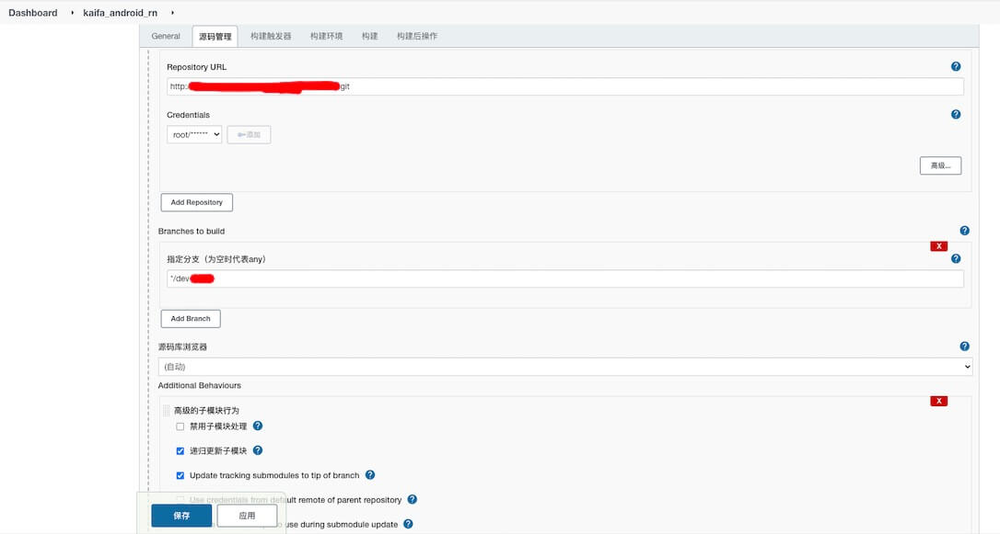
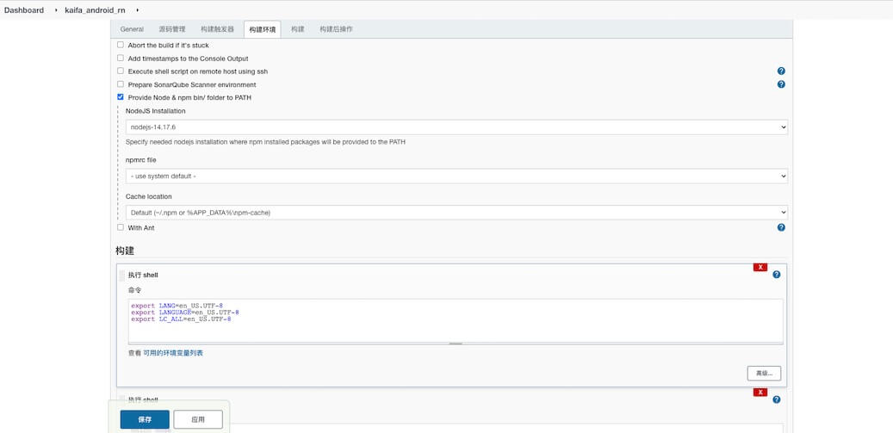

## Jenkins
- 集成React Native的Android工程打包配置，rn项目需要关联android子模块
.gitmodules文件示例如下
```
[submodule "android"]
    path = anroid
    url = git@127.0.0.1:app/android/xx.git
    branch = develop
```







- 
